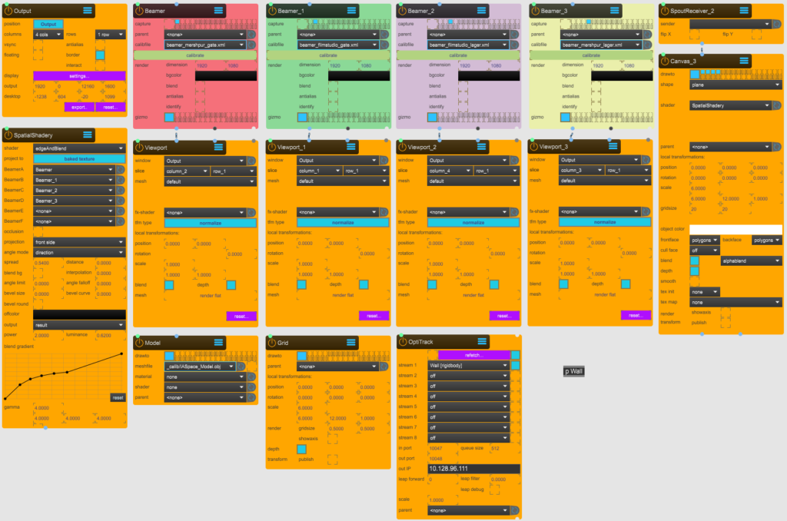
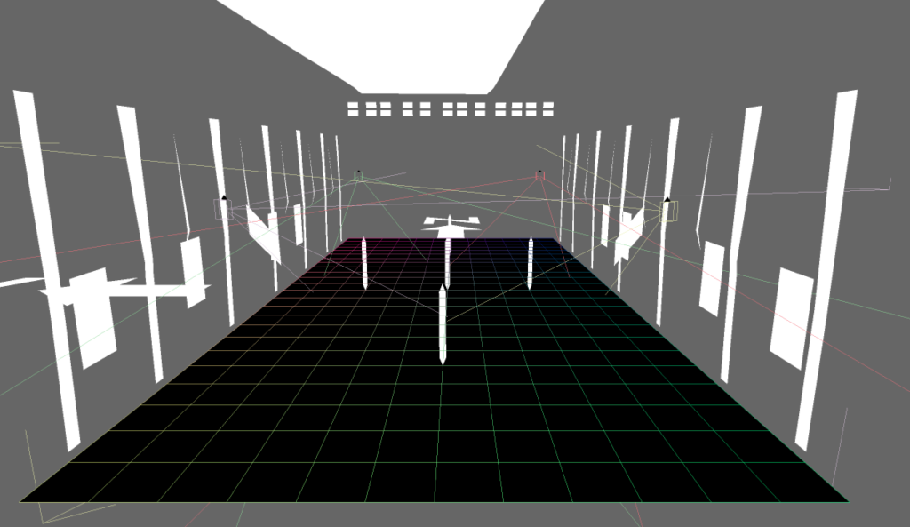
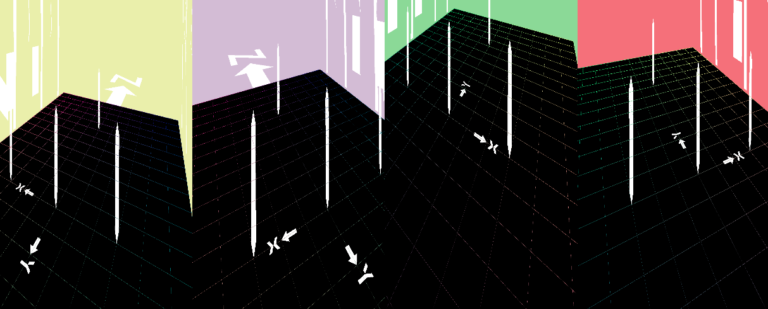
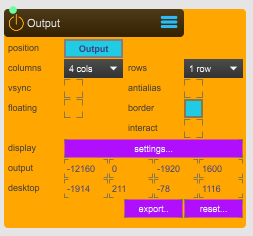
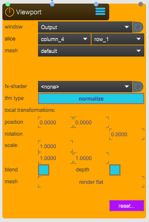
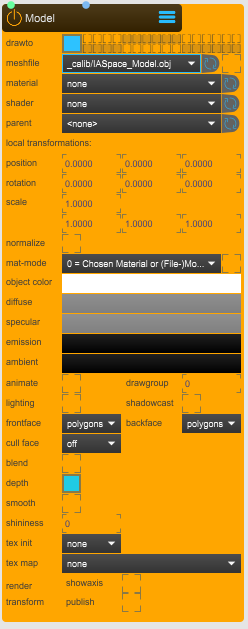
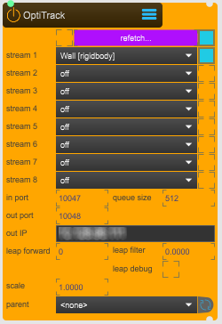

# Sparck basic setup
This article showcase the seutp for a common use case where 4 projectors are used to project on moving objects.

## Setup with 4 projectors

Sparck APP, 0_APP > APP.maxpat
Inside the p Workspace subpatcher, the image below shows an overall Max/MSP patcher to setup 4 projectors for Spatial Augmented Projection (SAR) on the floor.

p Workspace subpatch.
In white a highly precise simplified 3D model of the Immersive Arts Space. In black, a floor plane (see Canvas node) with a grid. And 4 colored wireframes, displaying the positions of the projectors.

3D viewer of Sparck. Preview of the virtual setup.

Output preview of Spark. 4 frames are sicked together corresponding on the 3D view from each projector position after calibration. 4 different color are used to identify each beamer (see Beamer node with toggled indentify).

## Nodes basic configurations

Output node, 1_UTILITY > WINDOW.maxpat
**position**: switch between the Output or Desktop. Where Output display the visual content on the configured projectors and Desktop create a window to preview how the visual content is distributed.

columns and row: slice the output into designate frames.

**display**: pressing setting opens up a display setup tool to configure the Output overall pixel amount use for projection. (Store and Close when configured).

The computer is connected to 2 monitors of 1920 x 1200 pixels and 4 projectors of 2560 x 1600 pixels.

Beamer node, 2_SPACE > BEAMER.maxpat
**capture**: select in which render layer the beamer will be displayed.

**calibfile**: create and save a .xml file in which the projector information and position in 3D space will be stored.

**calibrate button**: launch the window editor to calibrate the projector.

**identify**: highlights in the projector Output and Desktop which projector is been calibrated by displaing a specific background color.

**gizmo**: displays on the 3D viewer the position of the projector.

Viewport, 1_UTILITY > VIEWPORT.maxpat
**window**: select the Output.

**slice**: select the designated frame wehre to output the visual content.

Model, 2_SPACE > MODEL.maxpat
**drawto**: selects the render layer where the model is rendered. In this case the model is only displayed on the Sparck preview and not outputted on the projectors.

**meshfile**: selects the mesh file to use/diplay. To import a 3D model, place it inside the Spark forlder directory under Sparck/_assets/_models.

**material**: select the material to use.

**hader**: select the shader to use.

Grid, 2_Space > GRID.maxpat
**drawto**: selects the render layer where the model is rendered. In this case the model is only displayed on the Sparck preview and not outputted on the projectors.

**scale**: 1 Sparck unit is 1 meter (100cm). In this case the scale is set on the size of IAS floor plan, 6m whide and 12m long.

**render gridsize**: changes the grid slice size.

**showaxis**: anable/disable the axis.

SpatialShadery, 7_EFFECTS > SPATIAL.SHADERY.maxpat

Optitrack, 4_TRANSFORM > OT.RECEIVER.maxpat
**stream 1-8**: select an Optritack rigidbody.

**in port**: set the port number at which the mocap stream is receiving.

out port**: set the port number at which the mocap stream is sent.

**out IP**: set the IP adress. In this case, the IP correspond Motive/Optitrack streaming IP.

**leap forward**: increases the forward prediction of the position and rotation of the rigidbodies. Since the speed at wich the projection refresh is lower from the speed of at which objects move in space. It prevent to see gitters on the projected visual content of traked objects.

SpoutReceiver, 5_INPUT > SPOUT.RECEIVER.maxpat
**sender**: select a Spout video stream.

**flip x**: flip the video stream horizontally.

**flip y**: flip the video stream vertically.

Canvas, 2_SPACE > CANVAS.maxpat
**drawto**: selects the render layer where the canvas is rendered. In this case the canvas is displayed on the Sparck preview and also on the projectors layers for ouput.

**shape**: select a basic shape to use. In this case is a basic plane but could be a sphere, torus, cylinder, ect. A custom file of a 3D object could be uploaded but the difference with a Model node, is that the Canvas node doesn't contains basic material, lighting, shadow, etc settings.

**shader**: select the shader to use. In this case a SpatialShadery shader is used.

**scale**: 1 Sparck unit is 1 meter (100cm). In this case, the scale is set on the size of IAS floor plan, 6m whide and 12m long.

## Costumize project
Add subpacthes accordingly to costomize the project, e.g add additionals tracked object for SAR, add a projection dome, etc.

p Patcher, contains additional Sparck nodes to project on a tracked plane surface.

p Wall subpatch, basic node setup for 1 traked plane displaying a looping video.